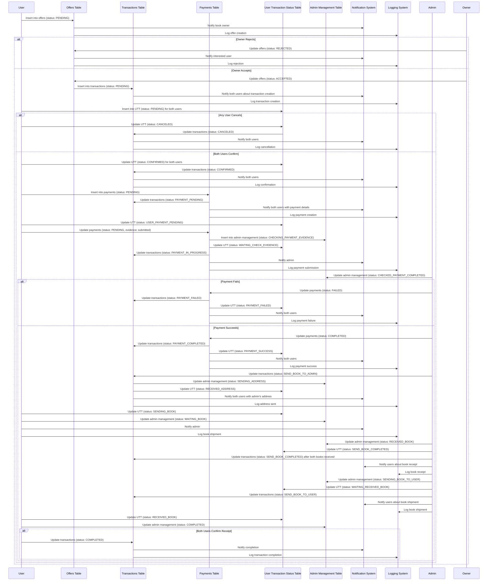

Got it! I'll focus on separating the user actions and automatic transitions in the entire process. Here's the detailed sequence of each part of the process, clearly indicating user actions and automatic transitions:

### Offer Creation Process

#### User Action: Creating an Offer

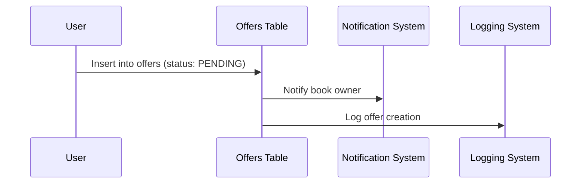

### Offer Response Process

#### User Action: Responding to an Offer

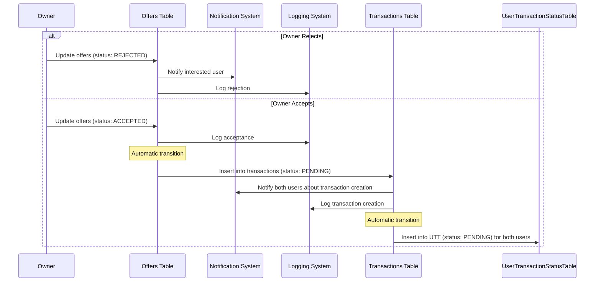

### User Transaction Status Creation Process

#### Automatic Transition: Creating User Transaction Status

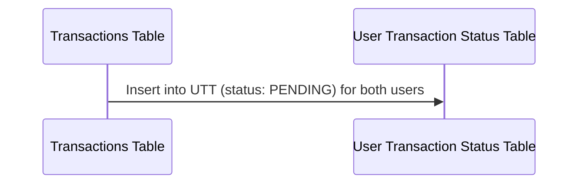

### User Cancellation Process

#### User Action: Canceling a Transaction

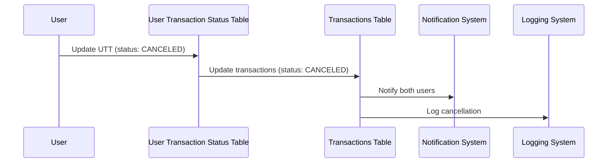

### User Confirmation Process

#### User Action: Confirming a Transaction

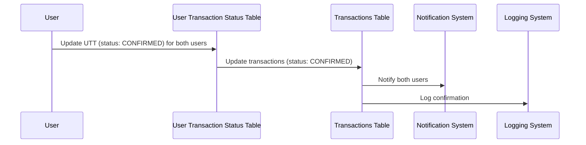

### Payment Initiation Process

#### User Action: Submitting Payment Evidence

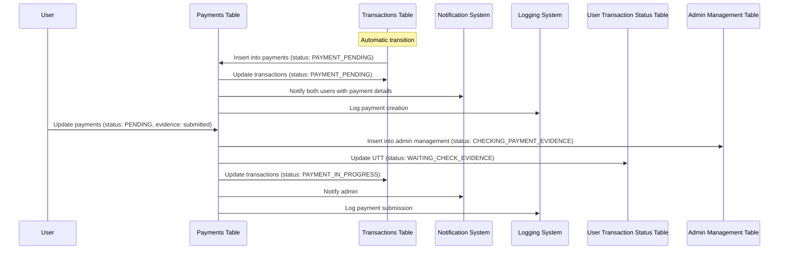

### Admin Payment Verification Process

#### Automatic Transition: Admin Verification of Payment

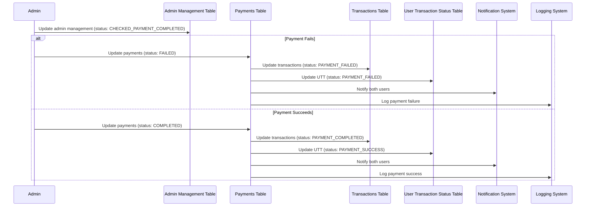

### Address Exchange Process

#### Automatic Transition: Sending Address

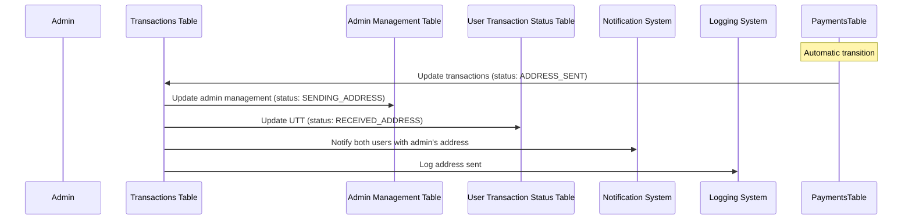

### Book Shipping Process

#### User Action: Sending the Book

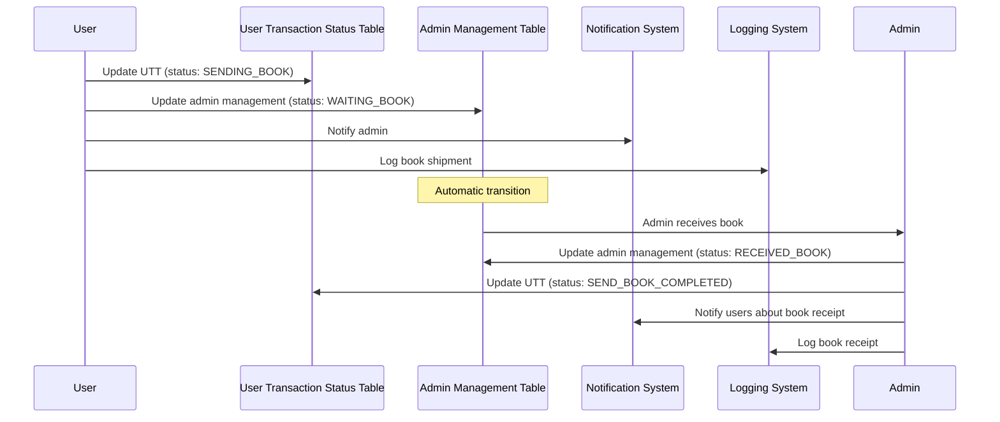

### Final Book Shipping to Users Process

#### Admin Action: Sending the Book to User

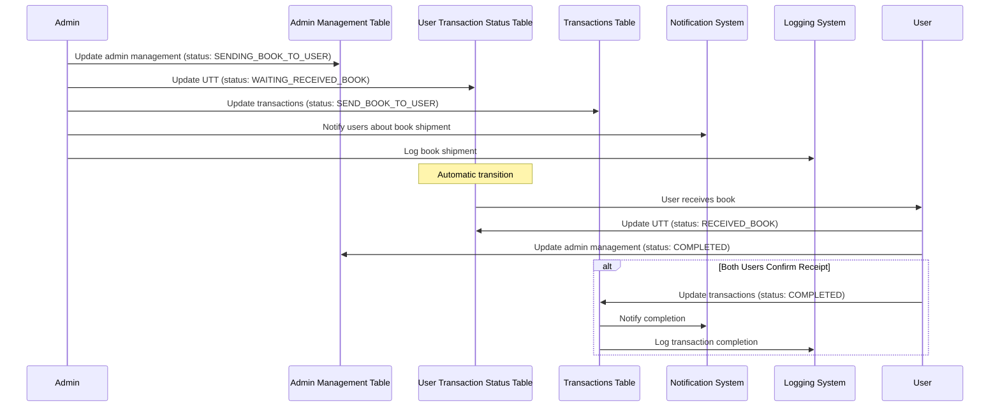

### Combined State Flowchart

#### Overall Process with User Actions and Automatic Transitions

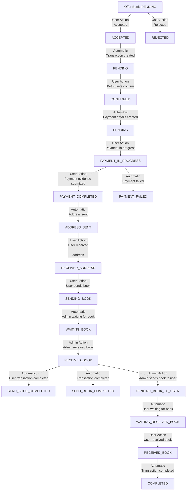

This detailed sequence breaks down the user actions and automatic transitions, ensuring that you can easily understand which parts are triggered by user actions and which are automatic.
