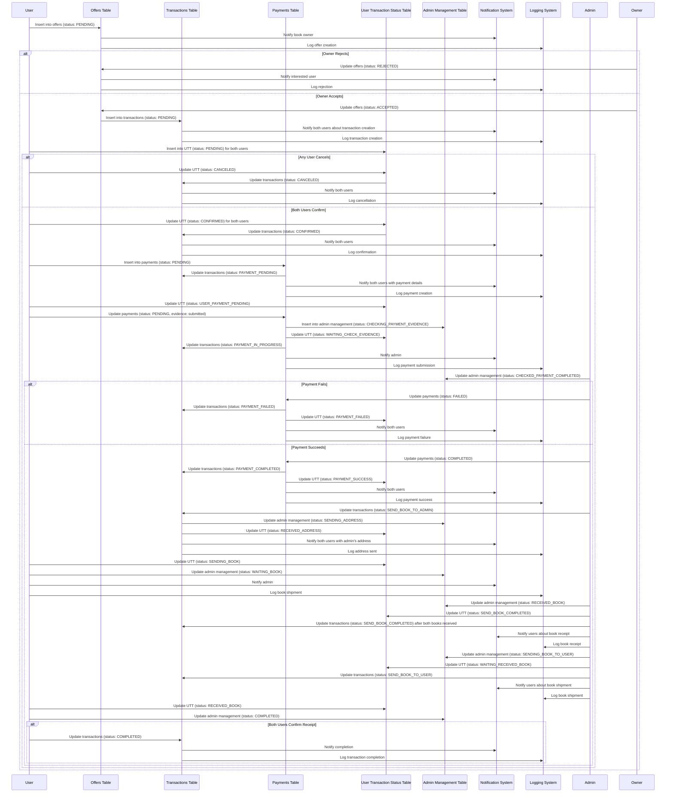

Understood. We'll combine the user actions with the automatic transitions into a single flow. Each diagram will reflect both the user-triggered actions and the subsequent automatic transitions that occur as a result. This will show the full lifecycle of each status update, including both manual and automatic parts.

### 1. handleCanceledCase

#### When User Cancels

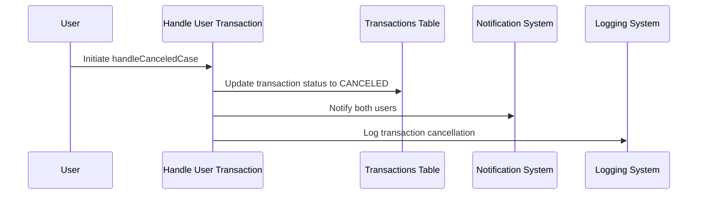

### 2. handleConfirmedCase

#### When User Confirms

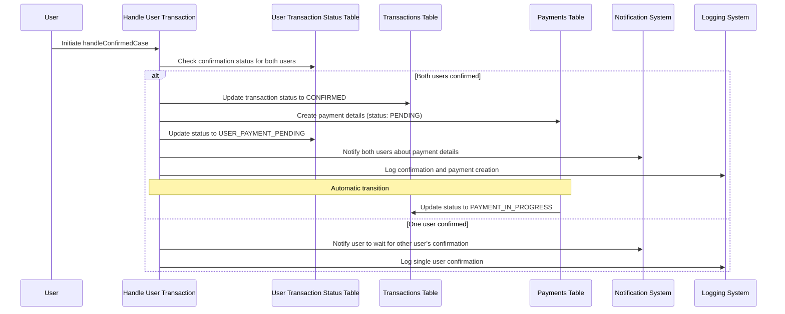

### 3. handleWaitingCheckEvidenceCase

#### When User Submits Payment Evidence

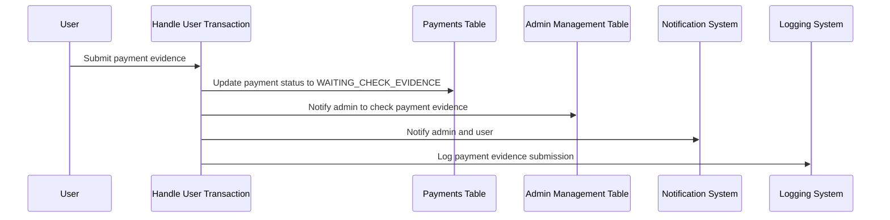

### 4. handlePaymentSuccessCase

#### When Payment is Successful

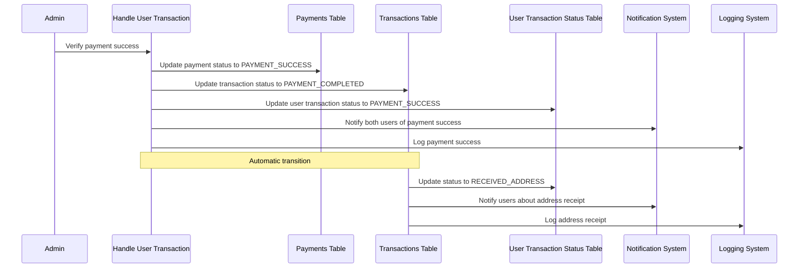

### 5. handlePaymentFailedCase

#### When Payment Fails

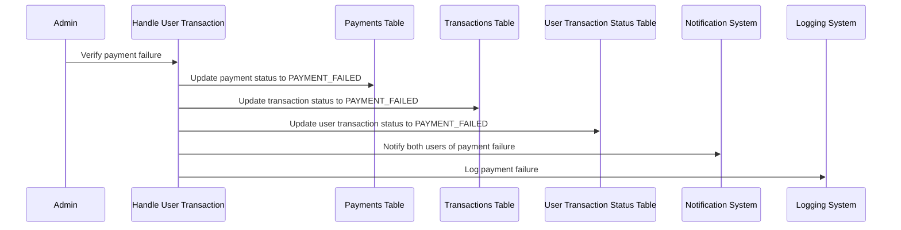

### 6. handleReceivedAddressCase

#### When Address is Received

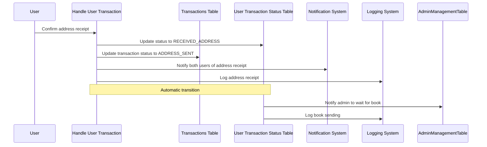

### 7. handleSendingBookCase

#### When User Sends the Book

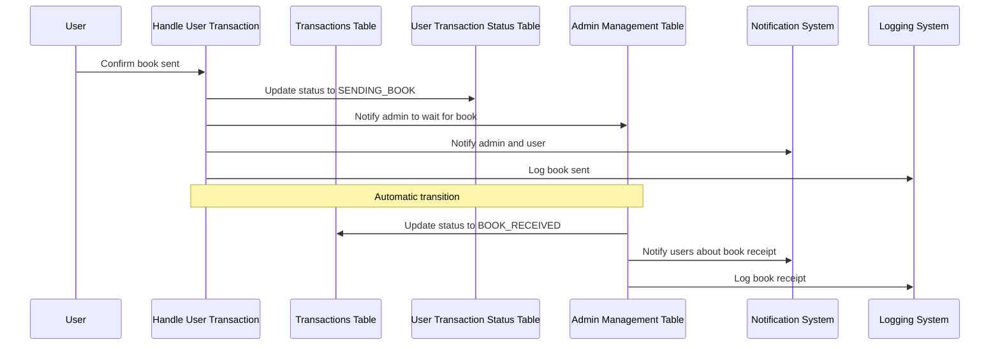

### 8. handleBookReceivedByAdminCase

#### When Admin Receives the Book

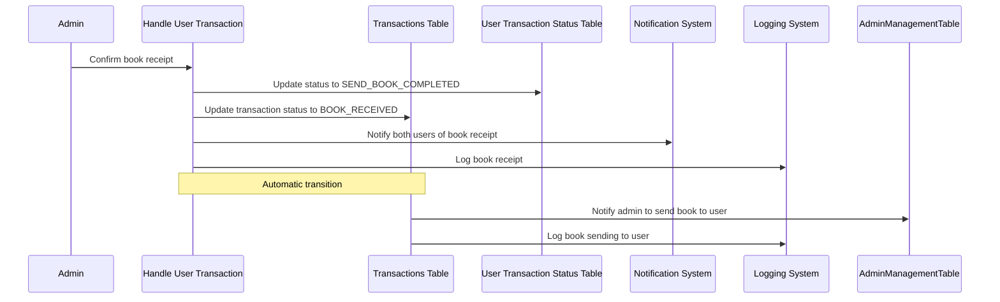

### 9. handleWaitingReceivedBookCase

#### When Waiting for Book Receipt

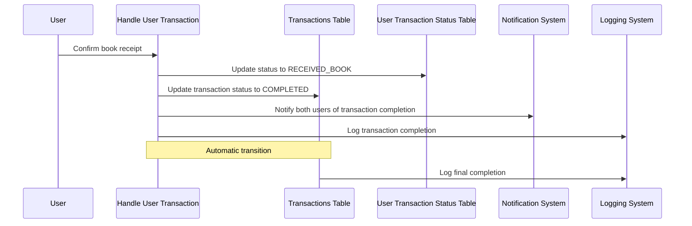

### Combined State Flowchart

#### Full Process Including User Actions and Automatic Transitions

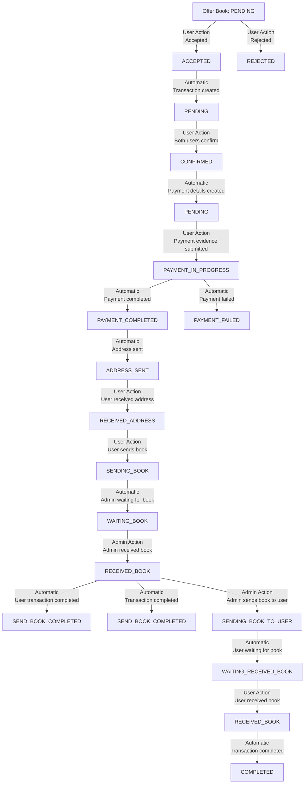

These combined diagrams reflect the full lifecycle of each status update, including both user actions and the automatic transitions that follow. This ensures that every aspect of the process is covered, showing how each state leads to the next.
