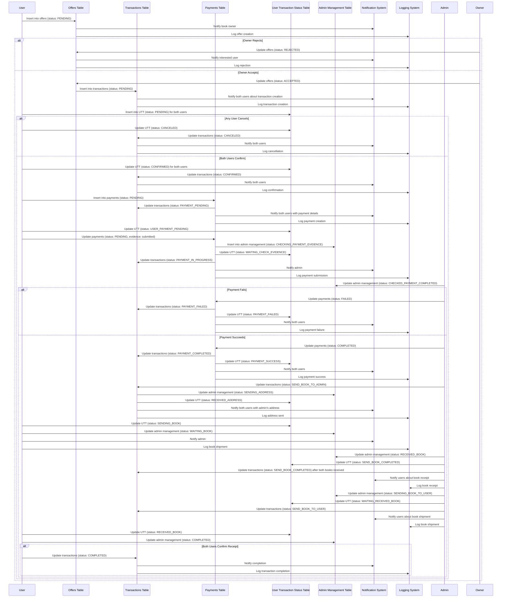

```mermaid
sequenceDiagram
    participant User
    participant OffersTable as Offers Table
    participant TransactionsTable as Transactions Table
    participant PaymentsTable as Payments Table
    participant UserTransactionStatusTable as User Transaction Status Table
    participant AdminManagementTable as Admin Management Table
    participant NotificationSystem as Notification System
    participant LoggingSystem as Logging System
    participant Admin

    User->>OffersTable: Insert into offers (status: PENDING)
    OffersTable->>NotificationSystem: Notify book owner
    OffersTable->>LoggingSystem: Log offer creation
    
    alt Owner Rejects
        Owner->>OffersTable: Update offers (status: REJECTED)
        OffersTable->>NotificationSystem: Notify interested user
        OffersTable->>LoggingSystem: Log rejection
    else Owner Accepts
        Owner->>OffersTable: Update offers (status: ACCEPTED)
        OffersTable->>TransactionsTable: Insert into transactions (status: PENDING)
        TransactionsTable->>NotificationSystem: Notify both users about transaction creation
        TransactionsTable->>LoggingSystem: Log transaction creation
        
        User->>UserTransactionStatusTable: Insert into UTT (status: PENDING) for both users
        
        alt Any User Cancels
            User->>UserTransactionStatusTable: Update UTT (status: CANCELED)
            UserTransactionStatusTable->>TransactionsTable: Update transactions (status: CANCELED)
            TransactionsTable->>NotificationSystem: Notify both users
            TransactionsTable->>LoggingSystem: Log cancellation
        else Both Users Confirm
            User->>UserTransactionStatusTable: Update UTT (status: CONFIRMED) for both users
            UserTransactionStatusTable->>TransactionsTable: Update transactions (status: CONFIRMED)
            TransactionsTable->>NotificationSystem: Notify both users
            TransactionsTable->>LoggingSystem: Log confirmation
            
            User->>PaymentsTable: Insert into payments (status: PENDING)
            PaymentsTable->>TransactionsTable: Update transactions (status: PAYMENT_PENDING)
            PaymentsTable->>NotificationSystem: Notify both users with payment details
            PaymentsTable->>LoggingSystem: Log payment creation
            
            User->>UserTransactionStatusTable: Update UTT (status: USER_PAYMENT_PENDING)
            
            User->>PaymentsTable: Update payments (status: PENDING, evidence: submitted)
            PaymentsTable->>AdminManagementTable: Insert into admin management (status: CHECKING_PAYMENT_EVIDENCE)
            PaymentsTable->>UserTransactionStatusTable: Update UTT (status: WAITING_CHECK_EVIDENCE)
            PaymentsTable->>TransactionsTable: Update transactions (status: PAYMENT_IN_PROGRESS)
            PaymentsTable->>NotificationSystem: Notify admin
            PaymentsTable->>LoggingSystem: Log payment submission
            
            Admin->>AdminManagementTable: Update admin management (status: CHECKED_PAYMENT_COMPLETED)
            
            alt Payment Fails
                Admin->>PaymentsTable: Update payments (status: FAILED)
                PaymentsTable->>TransactionsTable: Update transactions (status: PAYMENT_FAILED)
                PaymentsTable->>UserTransactionStatusTable: Update UTT (status: PAYMENT_FAILED)
                PaymentsTable->>NotificationSystem: Notify both users
                PaymentsTable->>LoggingSystem: Log payment failure
            else Payment Succeeds
                Admin->>PaymentsTable: Update payments (status: COMPLETED)
                PaymentsTable->>TransactionsTable: Update transactions (status: PAYMENT_COMPLETED)
                PaymentsTable->>UserTransactionStatusTable: Update UTT (status: PAYMENT_SUCCESS)
                PaymentsTable->>NotificationSystem: Notify both users
                PaymentsTable->>LoggingSystem: Log payment success
                
                Admin->>TransactionsTable: Update transactions (status: SEND_BOOK_TO_ADMIN)
                TransactionsTable->>AdminManagementTable: Update admin management (status: SENDING_ADDRESS)
                TransactionsTable->>UserTransactionStatusTable: Update UTT (status: RECEIVED_ADDRESS)
                TransactionsTable->>NotificationSystem: Notify both users with admin's address
                TransactionsTable->>LoggingSystem: Log address sent
                
                User->>UserTransactionStatusTable: Update UTT (status: SENDING_BOOK)
                User->>AdminManagementTable: Update admin management (status: WAITING_BOOK)
                User->>NotificationSystem: Notify admin
                User->>LoggingSystem: Log book shipment
                
                Admin->>AdminManagementTable: Update admin management (status: RECEIVED_BOOK)
                Admin->>UserTransactionStatusTable: Update UTT (status: SEND_BOOK_COMPLETED)
                Admin->>TransactionsTable: Update transactions (status: SEND_BOOK_COMPLETED) after both books received
                Admin->>NotificationSystem: Notify users about book receipt
                Admin->>LoggingSystem: Log book receipt
                
                Admin->>AdminManagementTable: Update admin management (status: SENDING_BOOK_TO_USER)
                Admin->>UserTransactionStatusTable: Update UTT (status: WAITING_RECEIVED_BOOK)
                Admin->>TransactionsTable: Update transactions (status: SEND_BOOK_TO_USER)
                Admin->>NotificationSystem: Notify users about book shipment
                Admin->>LoggingSystem: Log book shipment
                
                User->>UserTransactionStatusTable: Update UTT (status: RECEIVED_BOOK)
                User->>AdminManagementTable: Update admin management (status: COMPLETED)
                
                alt Both Users Confirm Receipt
                    User->>TransactionsTable: Update transactions (status: COMPLETED)
                    TransactionsTable->>NotificationSystem: Notify completion
                    TransactionsTable->>LoggingSystem: Log transaction completion
                end
            end
        end
    end

```