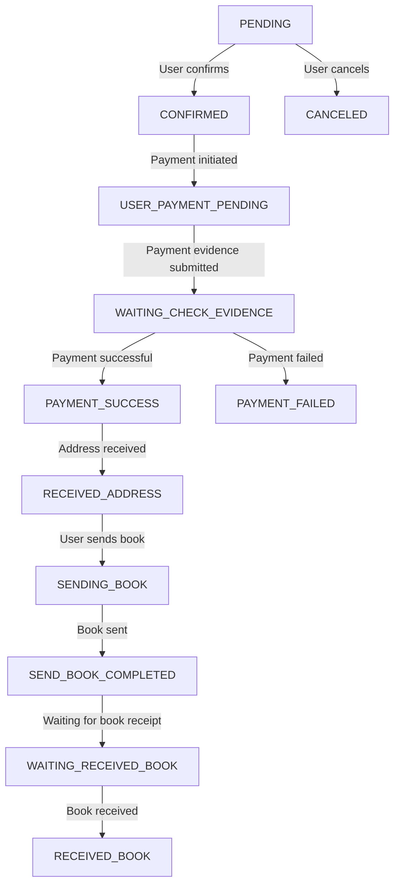
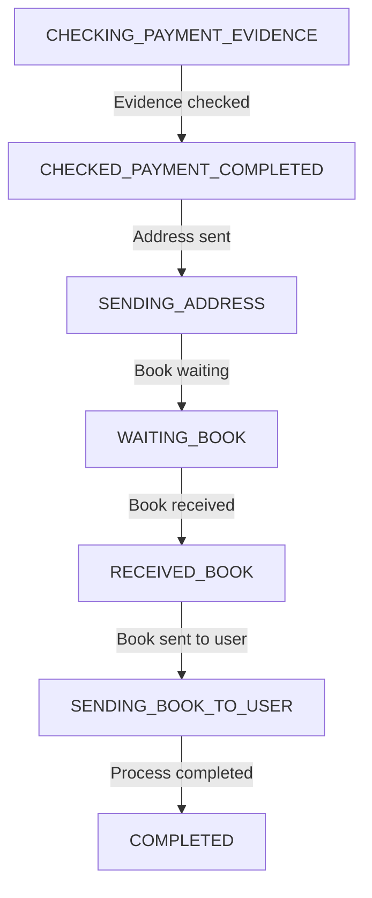
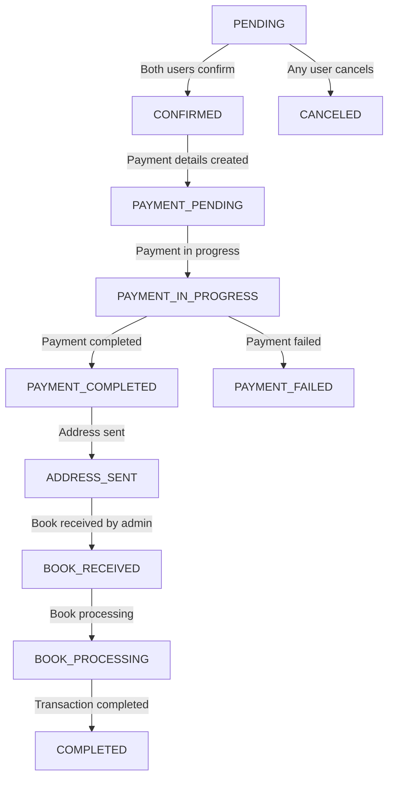
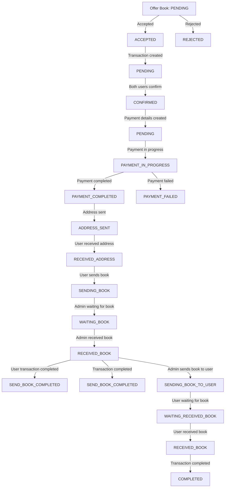

## User states flowchart

```mermaid

graph TD
    PENDING -->|User confirms| CONFIRMED
    PENDING -->|User cancels| CANCELED
    CONFIRMED -->|Payment initiated| USER_PAYMENT_PENDING
    USER_PAYMENT_PENDING -->|Payment evidence submitted| WAITING_CHECK_EVIDENCE
    WAITING_CHECK_EVIDENCE -->|Payment successful| PAYMENT_SUCCESS
    WAITING_CHECK_EVIDENCE -->|Payment failed| PAYMENT_FAILED
    PAYMENT_SUCCESS -->|Address received| RECEIVED_ADDRESS
    RECEIVED_ADDRESS -->|User sends book| SENDING_BOOK
    SENDING_BOOK -->|Book sent| SEND_BOOK_COMPLETED
    SEND_BOOK_COMPLETED -->|Waiting for book receipt| WAITING_RECEIVED_BOOK
    WAITING_RECEIVED_BOOK -->|Book received| RECEIVED_BOOK


```

## Admin States Flowchart

```mermaid

graph TD
    CHECKING_PAYMENT_EVIDENCE -->|Evidence checked| CHECKED_PAYMENT_COMPLETED
    CHECKED_PAYMENT_COMPLETED -->|Address sent| SENDING_ADDRESS
    SENDING_ADDRESS -->|Book waiting| WAITING_BOOK
    WAITING_BOOK -->|Book received| RECEIVED_BOOK
    RECEIVED_BOOK -->|Book sent to user| SENDING_BOOK_TO_USER
    SENDING_BOOK_TO_USER -->|Process completed| COMPLETED


```

## Transaction States Flowchart

```mermaid
graph TD
    PENDING -->|Both users confirm| CONFIRMED
    CONFIRMED -->|Payment details created| PAYMENT_PENDING
    PAYMENT_PENDING -->|Payment in progress| PAYMENT_IN_PROGRESS
    PAYMENT_IN_PROGRESS -->|Payment completed| PAYMENT_COMPLETED
    PAYMENT_IN_PROGRESS -->|Payment failed| PAYMENT_FAILED
    PAYMENT_COMPLETED -->|Address sent| ADDRESS_SENT
    ADDRESS_SENT -->|Book received by admin| BOOK_RECEIVED
    BOOK_RECEIVED -->|Book processing| BOOK_PROCESSING
    BOOK_PROCESSING -->|Transaction completed| COMPLETED
    PENDING -->|Any user cancels| CANCELED


```

# Combined State Flowchart

```mermaid
graph TD
    User1[Offer Book: PENDING] -->|Accepted| User2[ACCEPTED]
    User1 -->|Rejected| User3[REJECTED]
    User2 -->|Transaction created| Trans1[PENDING]
    Trans1 -->|Both users confirm| Trans2[CONFIRMED]
    Trans2 -->|Payment details created| Payment1[PENDING]
    Payment1 -->|Payment in progress| Payment2[PAYMENT_IN_PROGRESS]
    Payment2 -->|Payment completed| Payment3[PAYMENT_COMPLETED]
    Payment2 -->|Payment failed| Payment4[PAYMENT_FAILED]
    Payment3 -->|Address sent| Trans3[ADDRESS_SENT]
    Trans3 -->|User received address| UTT3[RECEIVED_ADDRESS]
    UTT3 -->|User sends book| UTT4[SENDING_BOOK]
    UTT4 -->|Admin waiting for book| Admin1[WAITING_BOOK]
    Admin1 -->|Admin received book| Admin2[RECEIVED_BOOK]
    Admin2 -->|User transaction completed| UTT5[SEND_BOOK_COMPLETED]
    Admin2 -->|Transaction completed| Trans4[SEND_BOOK_COMPLETED]
    Admin2 -->|Admin sends book to user| Admin3[SENDING_BOOK_TO_USER]
    Admin3 -->|User waiting for book| UTT6[WAITING_RECEIVED_BOOK]
    UTT6 -->|User received book| UTT7[RECEIVED_BOOK]
    UTT7 -->|Transaction completed| Trans5[COMPLETED]


```
