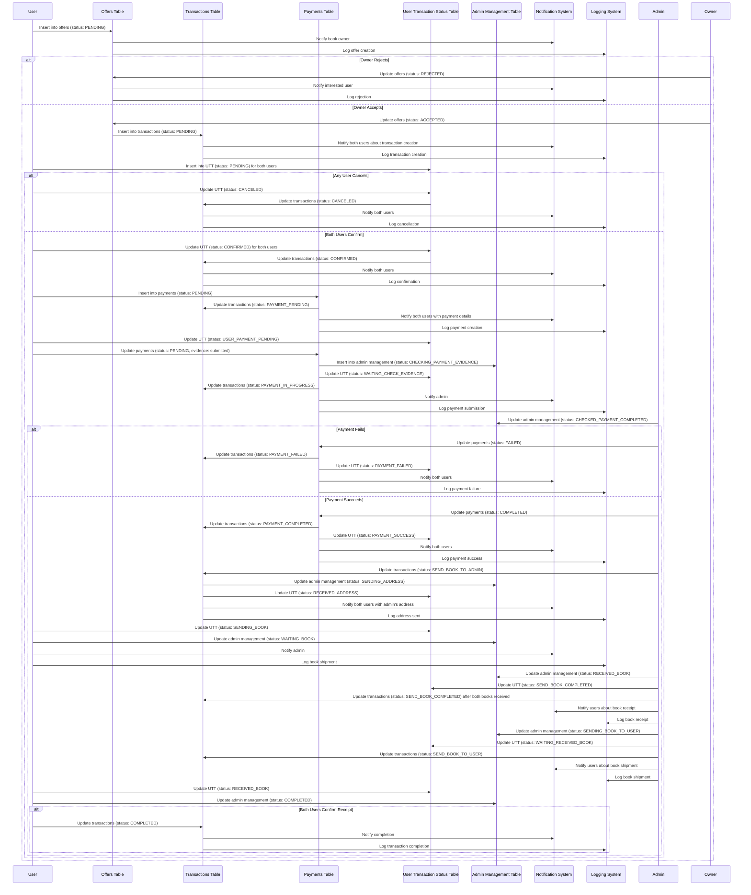

### handleCanceledCase

#### When User Cancels

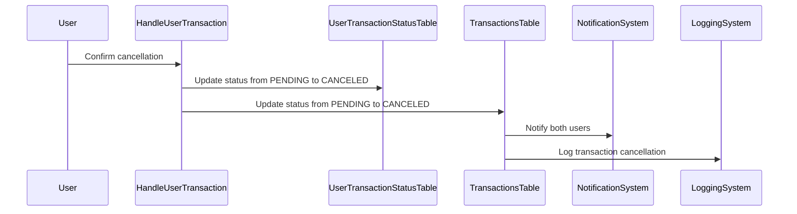

### handleConfirmedCase

#### When User Confirms

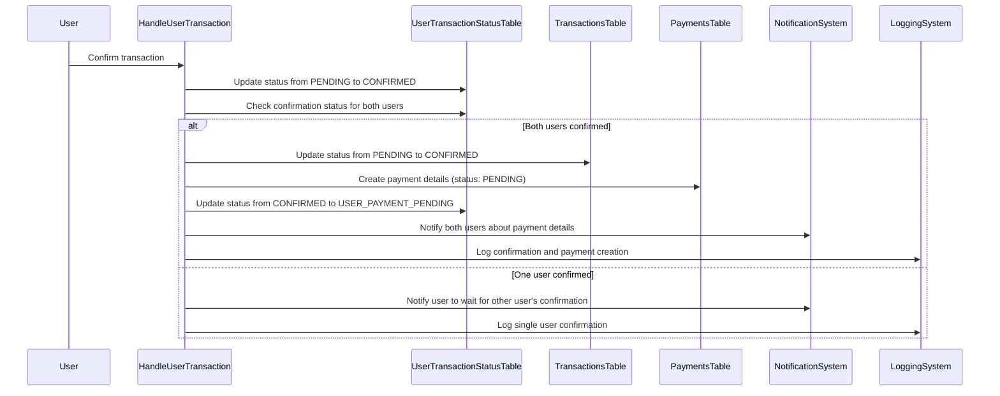

### handleWaitingCheckEvidenceCase

#### When User Submits Payment Evidence

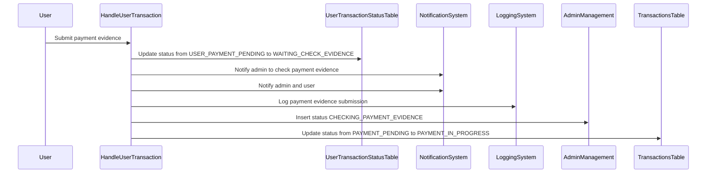

### handlePaymentSuccessCase

#### When Payment is Successful

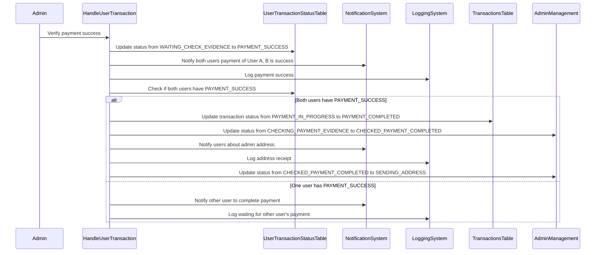

### handlePaymentFailedCase

#### When Payment Fails

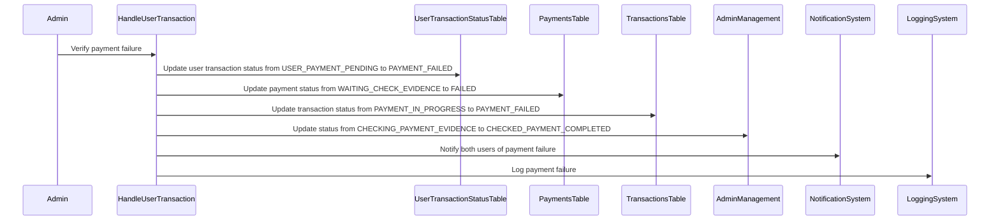

### handleReceivedAddressCase

#### When Address is Received

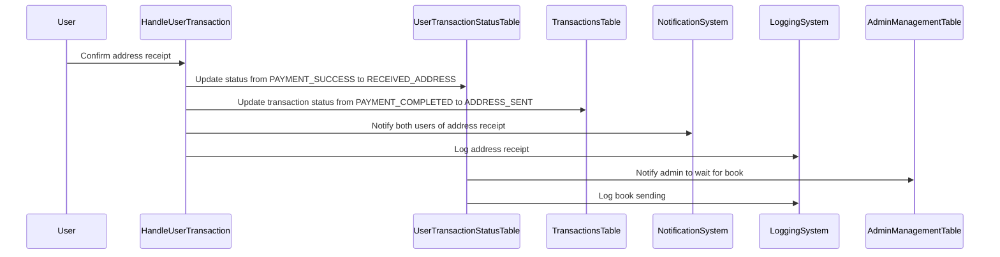

### handleSendingBookCase

#### When User Sends the Book

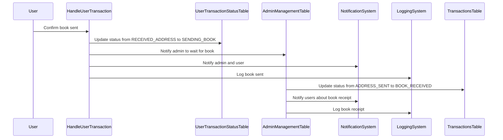

### handleBookReceivedByAdminCase

#### When Admin Receives the Book

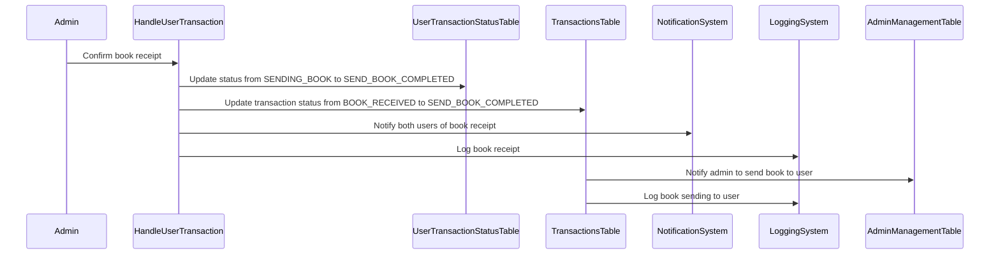

### handleWaitingReceivedBookCase

#### When Waiting for Book Receipt

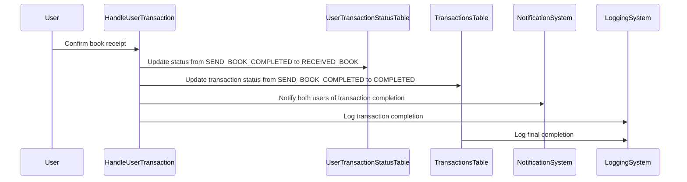

### Combined State Flowchart

#### Full Process Including User Actions and Automatic Transitions

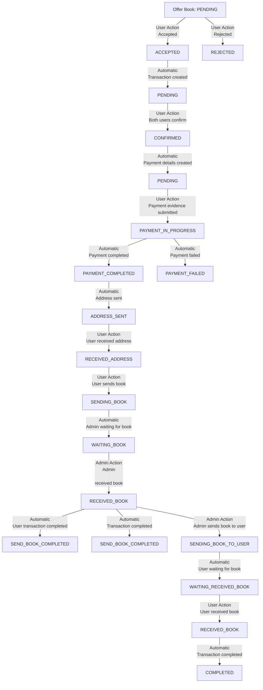

These diagrams now clearly show the user actions and the automatic updates that follow as part of each process.
