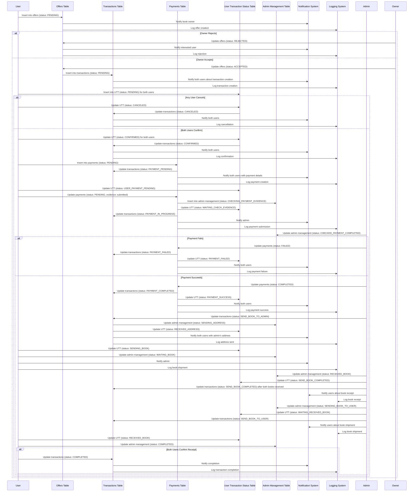
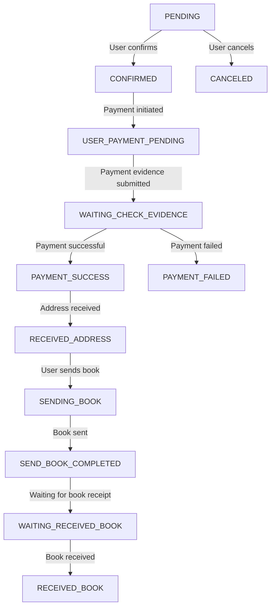
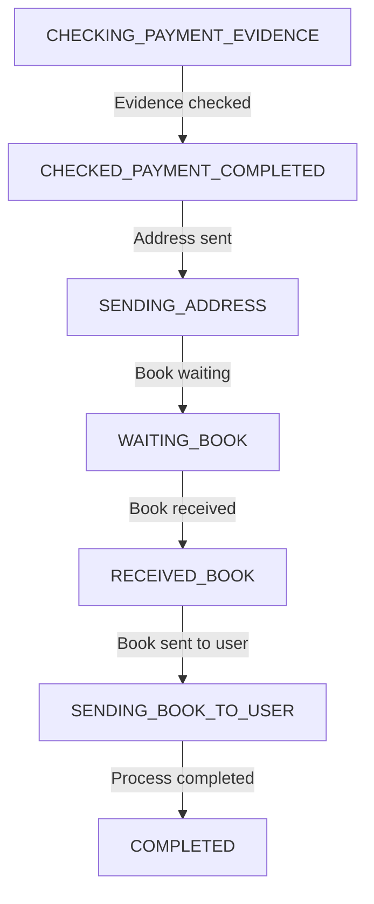
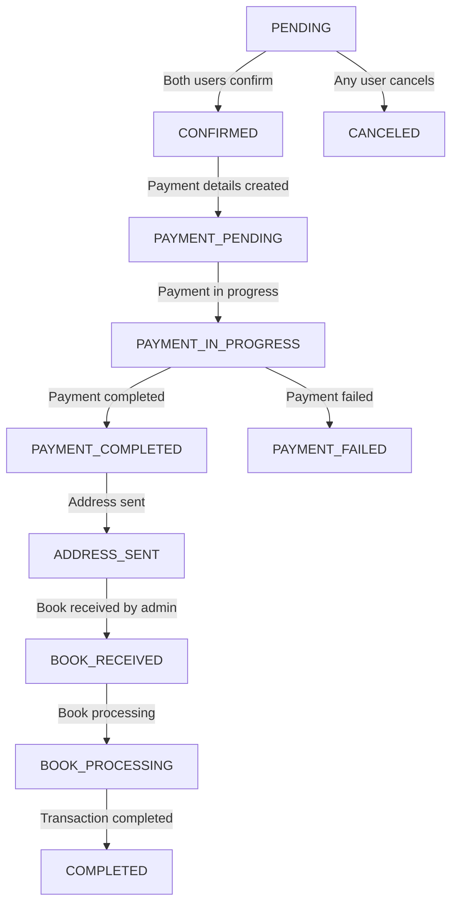
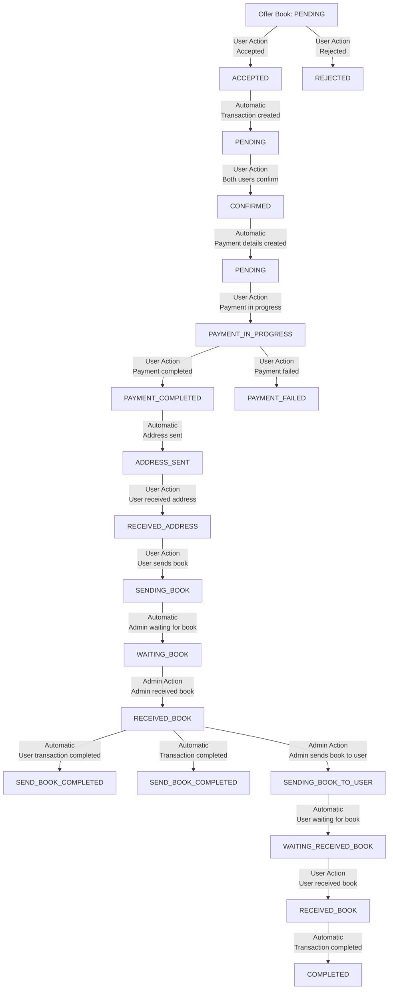

next after you got this data 
I think you can create new project construct by not follow my old data

our app is book-exchange app so at first user enter to our app, he will go to explore page
this page will have input search bar to search a book by book title, author in one input tab
next in this page will have categories that will show all genres of book and number of book for each genres
next is recently added 
will show lasted book and can see all to see lasted 100 added book
and next is most vied to see top 100 book view 
for month, week , day

this is explore section
then when user Is interest in some book he can click that book
then will go to book details pages
by have that books detail, owner 
if user is login card will have make offers button, if not will have button register to redirect to register process.
in register process it just basic register and login page (we call auth section).
after he complete will redirect back to that book detail page again.

then when he press make offers. it will show list of our books. by also can search and filter  sort like explore page (I forgot to tell you but in explore we also have features like this too)

after we see list of our app we can select one to exchange.
This will enter to Exchange process(for table like offers, transactions, adminMangaeent, userMangementStatus we can follow old flow chart for this features)

back to user thing
we have 1st explore page to view , search book and click to see book detail
then we have exchange page to manage and see our exchange status, take action with status

next is We call Profile/User area
I will list the thing that user can to then you group and give good name for it
- View user detail., update user profile, profile image , user address, select userAddress (we can add more than one then can select what we need to use). adjust some profile/ user data.  User can add book, update book, delete book, view own inventory books 
view all his exchange status that he have , and can manage it (maybe it same with exahcnage page) 
.... you can add more if I miss something 

this is flow from exchange if you forgot this is main flor for exchange

status change chart
## User states flowchart

## Admin States Flowchart

## Transaction States Flowchart

# Combined State Flowchart

